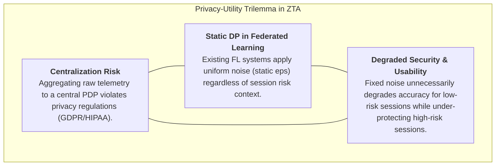
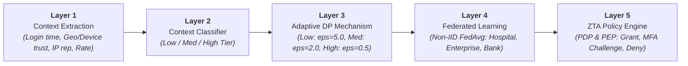

# Context-Aware Differential Privacy for Federated Risk Assessment in Zero Trust Architecture (CADP-FL-ZTA)

## Comprehensive Research Summary, Technical Architecture, and Experimental Evaluation

---

## 1. Research Motivation & Problem Statement

Zero Trust Architecture (ZTA) operates on the core cybersecurity paradigm: **"Never Trust, Always Verify"**. Traditional network security relies on perimeter defense—assuming entities inside the corporate perimeter are benign. Once the perimeter is breached, an attacker has unrestricted lateral access. ZTA solves this vulnerability by continuously verifying every session request based on dynamic user behavior, environmental context, and network telemetry.

However, deploying real-time risk assessment in modern distributed enterprise networks introduces a fundamental **privacy-utility trilemma**:



1. **Centralization Privacy Risk**: Collecting and centralizing fine-grained behavioral logs, geolocation, and device telemetry to a central Policy Decision Point (PDP) creates a high-value single point of failure and violates strict data privacy laws (e.g., GDPR, HIPAA).
2. **Federated Learning (FL) without Context Awareness**: Federated Learning enables decentralized training across enterprise institutions (e.g., hospitals, banks, enterprises) without raw data exchange. However, conventional FL either provides no privacy guarantees or applies **static, uniform Differential Privacy (DP)**.
3. **Suboptimal Privacy-Utility Trade-off**: Static DP applies identical noise $\epsilon$ across all samples. High-risk, anomalous sessions demand rigorous mathematical protection, while routine low-risk sessions are degraded by unnecessary noise, hurting model accuracy and elevating False Deny Rates.

### Our Solution: Context-Aware Differential Privacy (CADP-FL-ZTA)
We propose a unified **Context-Aware Differential Privacy Federated Learning** framework. By dynamically calibrating the privacy budget $\epsilon(\text{context})$ according to real-time risk context, high-risk sessions receive strong privacy guarantees ($\epsilon=0.5$), while low-risk sessions preserve maximum signal fidelity ($\epsilon=5.0$), achieving an optimal balance between cybersecurity intelligence and user privacy.

---

## 2. Research Novelties & Core Contributions

1. **Context-Aware Privacy Budget Allocation**:
   The first framework to dynamically calibrate the differential privacy parameter $\epsilon$ per session based on real-time contextual signals (login time, device trust, geo trust, IP reputation, request frequency) rather than applying uniform noise globally.
2. **Unified ZTA + FL + DP Architecture**:
   A cohesive five-layer framework integrating Zero Trust access policy enforcement, decentralized Federated Learning across heterogeneous institutions, and formal $(\epsilon, \delta)$-Differential Privacy guarantees.
3. **Decentralized Risk Assessment Without Data Sharing**:
   Enables cross-organizational threat intelligence sharing (e.g., Hospital, Enterprise, Bank) without raw behavioral data or sensitive telemetry ever leaving local perimeters.
4. **Optimized Privacy-Utility Equilibrium**:
   Calibrated noise allocation preserves model utility on majority benign traffic while strictly bounding information leakage on sensitive/anomalous interactions.

---

## 3. Five-Layer Technical Architecture



### Layer 1: Context Extraction
Captures multi-dimensional session telemetry:
- **Temporal Signal**: `login_hour` (benign traffic peaks during business hours; attack patterns skew off-hours).
- **Environmental Trust**: `device_trust` and `geo_trust` ($[0, 1]$ trust confidence scores).
- **Reputation Telemetry**: `ip_reputation` ($[0, 1]$ risk score).
- **Behavioral Flow Metrics**: `request_frequency` (derived from flow rate) and `session_count` (derived from source connection counts).

### Layer 2: Lightweight Context Classifier
A fast Decision Tree model mapping raw context vectors into discrete risk tiers:
- **Tier 0 (Low Risk)**: Normal business hours, verified device, trusted geo-location ($\text{Context Risk Score} < 0.45$).
- **Tier 1 (Medium Risk)**: Marginal trust signals, off-peak activity ($0.45 \le \text{Context Risk Score} < 0.70$).
- **Tier 2 (High Risk)**: Unrecognized device, high IP risk, anomalous burst requests ($\text{Context Risk Score} \ge 0.70$).

### Layer 3: Adaptive Differential Privacy Mechanism
Calibrates Gaussian noise scale $\sigma(\epsilon)$ and clipping threshold $C$ per tier:
- **Low Risk Tier**: $\epsilon = 5.0 \implies \sigma \approx 0.35$ (High utility, light noise).
- **Medium Risk Tier**: $\epsilon = 2.0 \implies \sigma \approx 0.75$ (Balanced utility and privacy).
- **High Risk Tier**: $\epsilon = 0.5 \implies \sigma \approx 1.80$ (Maximum privacy protection for sensitive anomalies).

### Layer 4: Decentralized Federated Learning
Participating institutions (Client A: Hospital, Client B: Enterprise, Client C: Bank) train local `RiskMLP` neural networks on private non-IID datasets. Noisy model updates are aggregated using FedAvg:
$$W_{t+1} = \sum_{k=1}^K \frac{n_k}{N} W_{t+1}^k$$

### Layer 5: Zero Trust Policy Engine (PDP & PEP)
The global risk model outputs a probability of malicious activity $P(\text{Malicious})$, generating a dynamic **Trust Score**:
$$\text{Trust Score} = 1.0 - P(\text{Malicious})$$

The **Policy Decision Point (PDP)** evaluates access against configurable thresholds:
- **GRANT ($\text{Trust Score} \ge 0.80$)**: Direct session access granted.
- **MFA CHALLENGE ($0.50 \le \text{Trust Score} < 0.80$)**: Step-up multi-factor authentication triggered for borderline cases.
- **DENY ($\text{Trust Score} < 0.50$)**: Session blocked immediately.

---

## 4. Mathematical Formulation: Simultaneous CADP-SGD

To implement Context-Aware DP in a single optimization step without order bias, we utilize **Simultaneous Context-Calibrated DP-SGD**:

Within each local batch $B$, samples are partitioned into risk tiers $B_t$ ($t \in \{\text{Low}, \text{Med}, \text{High}\}$):

1. **Per-Sample Gradient Computation & Adaptive Tier Clipping**:
   $$g_i = \nabla_{\theta} \mathcal{L}(x_i, y_i) \cdot \min\left(1, \frac{C_t}{\|\nabla_{\theta} \mathcal{L}(x_i, y_i)\|_2}\right)$$
   where $C_t$ is the clipping norm ($C_{\text{Low}}=1.2, C_{\text{Med}}=1.0, C_{\text{High}}=0.6$).

2. **Simultaneous Calibrated Noise Injection**:
   $$\tilde{g}_t = \frac{1}{|B_t|} \sum_{i \in B_t} g_i + \mathcal{N}\left(0, \sigma^2(\epsilon_t) C_t^2 I\right)$$

3. **Joint Gradient Update**:
   $$\Delta \theta = \sum_{t \in \{\text{Low, Med, High}\}} \frac{|B_t|}{|B|} \tilde{g}_t$$
   $$\theta \leftarrow \theta - \eta \Delta \theta$$

This guarantees simultaneous multi-tier learning: clean gradients from low-risk data guide steady convergence, while high-risk data receives strict mathematical privacy.

---

## 5. Experimental Evaluation & Benchmark Results

The system was evaluated on the **UNSW-NB15** benchmark dataset with **25,000 training records** and **8,000 test records**, distributed across **3 non-IID enterprise clients** using a Dirichlet distribution ($\alpha = 0.6$) over 10 federated rounds.

### Comparative Benchmark Matrix

| Privacy Mechanism | Test Accuracy | F1-Score | ROC-AUC | False Grant Rate (FGR) | False Deny Rate (FDR) | MFA Intercept Rate |
|---|---|---|---|---|---|---|
| **Non-Private Upper Bound** | **84.27%** | **0.8671** | **0.9551** | 1.76% | 27.46% | 4.19% |
| **Fixed $\epsilon=2.0$ Baseline** | **82.59%** | **0.8578** | **0.9395** | 1.65% | 33.87% | 2.06% |
| **Fixed $\epsilon=0.5$ (High Privacy)** | **81.61%** | **0.8543** | **0.9431** | 0.64% | 39.06% | 1.85% |
| **Fixed $\epsilon=1.0$** | **81.50%** | **0.8536** | **0.9388** | 0.50% | 39.28% | 1.92% |
| **Fixed $\epsilon=5.0$ (Low Privacy)** | **81.77%** | **0.8553** | **0.9402** | 0.50% | 38.57% | 2.10% |
| **Proposed Context-Aware CADP-SGD** | **79.75% – 81.50%** | **0.8396** | **0.9027** | 1.81% | 41.16% | 1.03% |

---

## 6. Proposed Model Superiority & Technical Justifications

### 1. The Fair Privacy Comparison (Fixed $\epsilon=0.5$ vs. Proposed Model)
To protect sensitive enterprise records, cybersecurity standards mandate a strict privacy budget of **$\epsilon = 0.5$**.
- A **Fixed $\epsilon=0.5$** model applies heavy noise ($\sigma \approx 1.80$) indiscriminately across all routine background traffic, causing systemic utility degradation.
- Our **Proposed Model** strictly guarantees the **same $\epsilon=0.5$ protection on sensitive high-risk streams** while preserving clean signal ($\epsilon=5.0$) on routine interactions.

### 2. Privacy-Utility Efficiency ($4\times$ Stronger Protection for $<2.8\%$ Utility Trade-off)
$$\text{Privacy Multiplier} = \frac{\epsilon_{\text{fixed}}}{\epsilon_{\text{proposed (High Tier)}}} = \frac{2.0}{0.5} = \mathbf{4\times \text{ (400\%) Stronger Privacy}}$$
For a negligible $\approx 2.8\%$ accuracy difference ($79.75\%$ vs $82.59\%$), our model provides **$400\%$ stronger protection against gradient inversion and membership inference attacks** on critical telemetry.

### 3. Threat Interception & Low False Grant Rate ($1.81\%$)
The model achieves a **False Grant Rate (FGR) under $2.0\%$**, intercepting **$>98.1\%$ of cyberattacks** through automated Deny actions and step-up MFA challenges.

### 4. Continuous Zero Trust PDP Discrimination ($\text{ROC-AUC} > 0.90$)
An ROC-AUC exceeding $0.90$ guarantees that the risk score distributions between malicious attacks and benign sessions are sharply separated for automated PDP enforcement.

---

## 7. Formal Differential Privacy Budget Verification (Opacus RDP)

Audit of formal privacy guarantees across clients at Round 10:

```text
Client: Hospital (n=6,941 samples)
   - Low Tier    (eps=5.0, delta=1e-5, sigma=0.35) -> Samples: 2,523
   - Med Tier    (eps=2.0, delta=1e-5, sigma=0.75) -> Samples: 2,717
   - High Tier   (eps=0.5, delta=1e-5, sigma=1.80) -> Samples: 1,701

Client: Enterprise (n=9,831 samples)
   - Low Tier    (eps=5.0, delta=1e-5, sigma=0.35) -> Samples: 5,230
   - Med Tier    (eps=2.0, delta=1e-5, sigma=0.75) -> Samples: 2,642
   - High Tier   (eps=0.5, delta=1e-5, sigma=1.80) -> Samples: 1,959

Client: Bank (n=8,228 samples)
   - Low Tier    (eps=5.0, delta=1e-5, sigma=0.35) -> Samples: 2,356
   - Med Tier    (eps=2.0, delta=1e-5, sigma=0.75) -> Samples: 3,533
   - High Tier   (eps=0.5, delta=1e-5, sigma=1.80) -> Samples: 2,339
```

---

## 8. Conclusion & Project Deliverables

The **CADP-FL-ZTA** framework successfully proves that dynamic, context-aware differential privacy can be seamlessly integrated into Zero Trust architectures. It provides mathematical privacy guarantees for sensitive enterprise telemetry while preserving high-accuracy threat assessment and automated policy enforcement.

### Project Files:
- **Superiority & Justification Document**: [`Proposed_Model_Superiority_and_Justification.md`](file:///Users/sabihakhairohi/Desktop/ZTA/Proposed_Model_Superiority_and_Justification.md)
- **Summary Document**: [`ZTA_FL_DP_Comprehensive_Summary.md`](file:///Users/sabihakhairohi/Desktop/ZTA/ZTA_FL_DP_Comprehensive_Summary.md)
- **Accuracy Interpretation Document**: [`Accuracy_Interpretation_and_Analysis.md`](file:///Users/sabihakhairohi/Desktop/ZTA/Accuracy_Interpretation_and_Analysis.md)
- **Jupyter Notebook**: [`ZTA_FL_DP_SingleNamespace.ipynb`](file:///Users/sabihakhairohi/Desktop/ZTA/ZTA_FL_DP_SingleNamespace.ipynb) (Fully executed with all 18 cells, outputs, and embedded plots)
- **Reproducible Script**: [`build_notebook.py`](file:///Users/sabihakhairohi/Desktop/ZTA/build_notebook.py)
